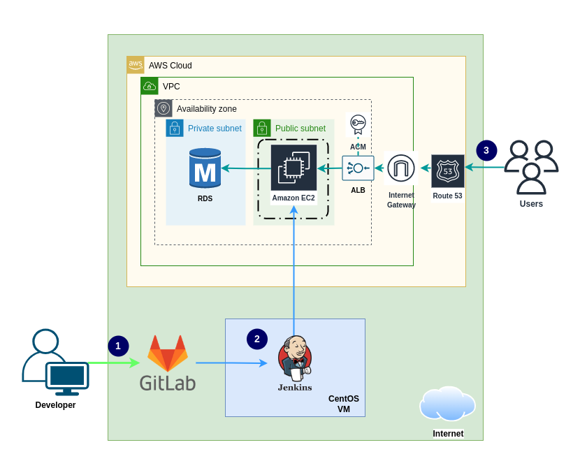

# Deploy Java MySQL app in AWS cloud with CI/CD Pipeline

A complete CI/CD project with Jenkins pipeline to build and deploy a GitLab repository in AWS cloud.

## Project Description

Prepare EC2 Launch template to run with Auto-scaling. Configure a Route 53 domain and TLS certificate with a Load balancer for the application. Prepare RDS database for the VPC network. Configure a Jenkins CI/CD pipeline to build and run a Java application in an EC2 instance.

### Architecture Diagram

## Project Setup

### Pre-requisites

Prepare one virtual machines in RHEL 9 equivalent environment.

### Setup AWS services

- Create VPC, subnets, and route tables
- Create EC2 instance launch template with a [script](./data/launch-template-user-data-personal.txt) (user-data)
- Create SSL/TLS Certificate for Load balancer
- Create Auto scaling group and Load balancer
- Create RDS database
- Create Route 53 domain

### Setup Gitlab repository

- Create Gitlab repository
- Configure SSH key with developer and Gitlab.

### Prepare Jenkins server

#### Install Jenkins by Ansible

Follow this [jenkins-docker-setup-playbook](https://github.com/mohammadrony/jenkins-docker-setup-playbook) to setup Jenkins server by running Ansible playbook. Please note that we only need [jenkins-setup](https://github.com/mohammadrony/jenkins-docker-setup-playbook/tree/main/jenkins-setup) role for this application.

#### Configure Jenkins server tools and credentials

Tools setup:

- JDK - Name: `Java_11`, JAVA_HOME: `/usr/lib/jvm/java-11-openjdk`
- Git - Name: `Git`, Path executable: `/usr/bin/git`
- Maven - Name: `Maven_3`, MAVEN_HOME: `/usr/share/maven`

Credentials setup:

- Kind: 'SSH Username with private key', ID: `aws_ssh_key`, Username: `<username>`, Private key: Enter directly `<ssh-private-key>`.
- Kind: 'SSH Username with private key', ID: `gitlab_ssh_key`, Username: `<username>`, Private key: Enter directly `<ssh-private-key>`.

#### Configure new pipeline from dashboard

- Create New Item > Enter name (aws-deploy) > Select 'Pipeline' type.
- Goto 'Your pipeline' > Configure > Select Poll SCM > Set schedule `H/2 * * * *` > Select Pipeline script from SCM > Repository URL > Select your branch to build > Script Path (Jenkinsfile) > Save.
- Goto 'Your pipeline' > Build Now.

### Update application.properties for database host

Update RDS database host name in [application.properties](src/main/resources/application.properties) file.

## Deploy new update with CI/CD pipeline

Creating new commit in the repository will trigger a new build with following stages:

- Git Clone
- Build Artifact
- Push app to EC2
- Update Running App

## Browse the application from a browser

- Visit http://your-domain.com from your local browser.
- Use username 'admin' and password 'admin' to login to the dashboard.

Thank you.
