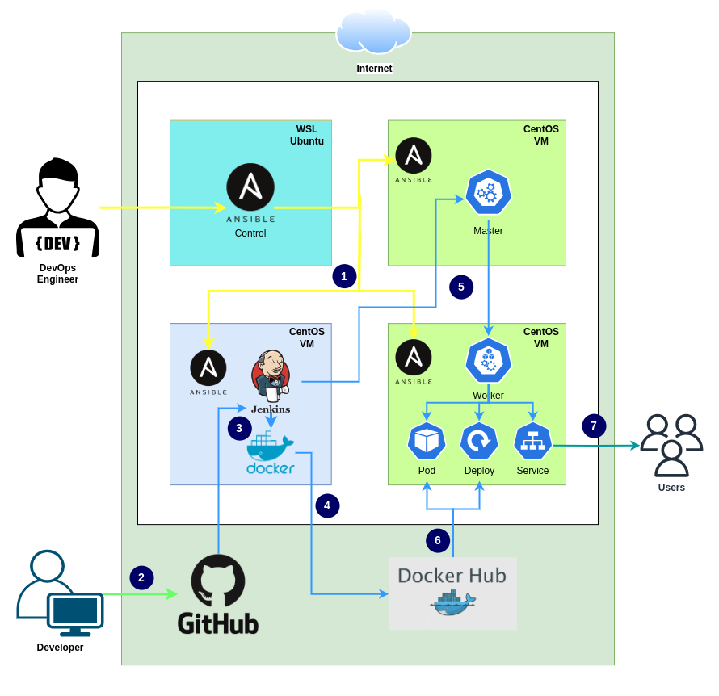

# Deploy Java MySQL app with CI/CD Pipeline

A complete CI/CD project to build and publish an application by Jenkins to the Kubernetes cluster.

_Follow [aws branch](https://github.com/mohammadrony/Java-CI-CD/tree/aws) for AWS cloud deployment steps._

## Project Description

Initially, configure a Kubernetes cluster with 1 master node, 1 worker node and a Jenkins server with Docker and Kubectl setup by Ansible playbook. Then automate build and publish of a Java application with MySQL database in Kubernetes cluster using CI/CD pipeline.

### Architecture diagram

## Project Setup

### Pre-requisites

Prepare three virtual machines in RHEL 9 equivalent environment. One of them is for the Kubernetes master node, another one is for the worker node and the third is for the Jenkins server.

### Prepare Kubernetes cluster using Ansible

Follow this [kubernetes-cluster-setup-playbook](https://github.com/mohammadrony/kubernetes-cluster-setup-playbook) to setup Kubernetes cluster by running an Ansible playbook.

### Prepare Jenkins server

#### Install Jenkins, Docker, and Kubectl by Ansible

Follow this [jenkins-docker-setup-playbook](https://github.com/mohammadrony/jenkins-docker-setup-playbook) to install Jenkins server, Docker, Kubectl by running an Ansible playbook.

#### Plugins and tools setup from Jenkins dashboard

Install Plugins:

- Docker
- Docker Pipeline
- Kubernetes
- Kubernetes CLI

Tools setup:

- JDK - Name: `Java_11`, JAVA_HOME: `/usr/lib/jvm/java-11-openjdk`
- Git - Name: `Git`, Path executable: `/usr/bin/git`
- Maven - Name: `Maven_3`, MAVEN_HOME: `/usr/share/maven`
- Docker - Name: `Docker_24`, Installation root: `/usr/bin/`

#### Credentials setup from Jenkins dashboard

- Kind: 'Username with password', ID: `docker_credentials`, Username: `<username>`, Password: `<docker_access_token>`.
- Kind: 'Secret file', ID: `kubeconfig`, File: select your kubeconfig.txt file.

#### Configure new pipeline from Jenkins dashboard

- Create New Item > Enter name (kubernetes-deploy) > Select ‘Pipeline’ type.
- Goto ‘Your pipeline’ > Configure > Select Poll SCM > Set schedule `H/2 * * * *` > Select Pipeline script from SCM > Repository URL > Select your branch to build > Script Path (Jenkinsfile) > Save.
- Goto ‘Your pipeline’ > Build Now.

## Deploy new update with CI/CD pipeline

Creating new commit in the repository will trigger a new build with following stages:

- Git Clone
- Build Artifact
- Build Container Image
- Publish Docker Image
- Deploy App in Kubernetes

## Browse the application from a browser

- Visit <http://worker-node-address> from your local browser.
- Use username 'admin' and password 'admin' to login to the dashboard.
